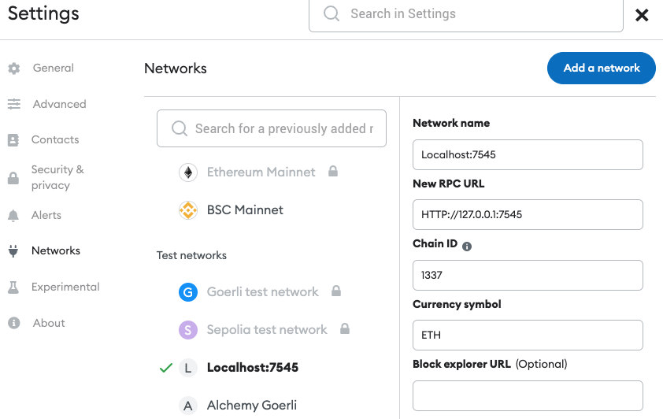

# Web3 Toy

<p align="center"></p>

This is a toy project, a simple React application that allows a user to connect their web3 wallet (XDEFI, Metamask, etc) to interact with a smart contract on the Ethereum blockchain.

## Getting Started

#### Download source

Open a terminal and run the following commands:

```bash
$ git clone https://github.com/jscriptcoder/web3-toy.git
$ cd web3-toy
```

#### Installing and running development env

Install all the dependencies:
```bash
$ npm install
```

This project has been tested in a local blockchain like [Ganache](https://trufflesuite.com/docs/ganache/)
<p align="center"></p>

Create a `.env` file with the following environment variables (see [.env.example](.env.example) file):
```
# .env

MNEMONIC=...
NEXT_PUBLIC_PROJECT_URL=http://127.0.0.1:7545
NEXT_PUBLIC_NETWORK_ID=5777
```
The `MNEMONIC` 12 words are provided by Ganache.

Create a new network, local network, in Metamask with the following settings:
<p align="center"></p>

The next step is to import accounts into your metamask using the private keys of the accounts provided also by Ganache.
