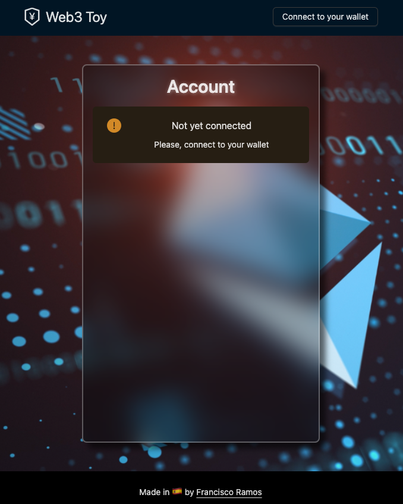

# Web3 Toy

<p align="center"></p>

This is a toy project, a simple React application that allows a user to connect their web3 wallet (XDEFI, Metamask, etc) to interact with a smart contract on the Ethereum blockchain.

## Getting Started

### Download source

Open a terminal and run the following commands:

```bash
$ git clone https://github.com/jscriptcoder/web3-toy.git
$ cd web3-toy
```

### Installing and running development env

Install all the dependencies:
```bash
$ npm install
```

This project has been tested in a local blockchain like [Ganache](https://trufflesuite.com/docs/ganache/)
<p align="center"></p>

Create a `.env` file with the following environment variables (see [.env.example](.env.example) file):
```
# .env

MNEMONIC=...
NEXT_PUBLIC_PROJECT_URL=http://127.0.0.1:7545
NEXT_PUBLIC_NETWORK_ID=5777
```
The `MNEMONIC` 12 words are provided by Ganache. This is important because we're gonna be deploying the contracts, mint MockERC20 tokens, fund TokenVesting and set vesting schedule in order to later on test functionality with one of our accounts.

Create a new network, local network, in Metamask with the following settings:
<p align="center"></p>

The next step is to import accounts into your metamask using the private keys of the accounts provided also by Ganache.

Last thing we need to do before running the development environment is to deploy the contracts, as mentioned before, mint tokens, fund our vesting contract and set a vesting schedule so we can claim tokens with one of our accounts.

Compile and deploy contracts:
```bash
$ npm run migrate
```
This command will create the contract artifacts with the ABI and contract address, which will be used by the Frontend to interact with the them (see [web3-helper.ts](utils/web3-helper.ts))

Mint tokens with the following script. You can pass de amount of tokens you want to mint:
```bash
$ node scripts/mintTokens.js 1000000
1000000 tokens minted
```

Fund our vesting contract. You can pass the amount of tokens:
```bash
$ node scripts/fundVesting.js 1000
Contract has been funded with 1000 tokens
```

Set a vesting schedule for a given account passed as argument:
```bash
$ node scripts/setVestingSchedule.js 0xFeEC856534DB03a81b70Afe4edcA9C976C818291
Set vesting schedule for account 0xFeEC856534DB03a81b70Afe4edcA9C976C818291
```
Keep in mind that the schedule is hardcoded in the script. If you want to make changes there, edit the [setVestingSchedule.js](scripts/setVestingSchedule.js) and set the values of the schedule object properties:
```js
const schedule = {
  startTime: 1675379777,
  cliff: 0,
  totalPeriods: 10,
  timePerPeriod: 1,
  totalTokens: 100,
  tokensClaimed: 0,
}
```

Now we're ready to go. Run the development environment and go to http://localhost:3000/:
```bash
$ npm run dev
ready - started server on 0.0.0.0:3000, url: http://localhost:3000
```
<p align="center"></p>

### Playing around with the app

1. Connect your wallet
<p align="center">


</p>

2. Wallet successfully connected
<p align="center">


</p>

3. Query vesting tokens
<p align="center">
  
  
</p>

4. Claim tokens
<p align="center">
  
  
</p>
